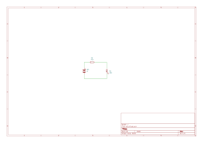
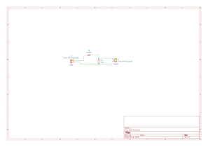
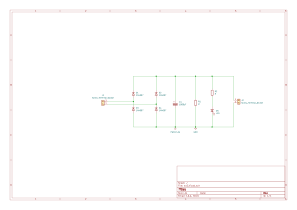
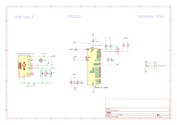
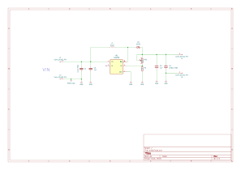
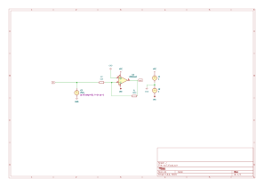

# KiCad Projects Portfolio

This repository contains my electronics projects designed using **KiCad**.  
Each project includes schematic/PCB designs exported as **SVG images**.

I am a **first year engineering student**, and these projects reflect my learning in
basic electronics, circuit design, and PCB layout.

---

## 🔹 ew1 – LED Blinking Circuit PCB using KiCad
A simple LED blinking circuit designed using the **NE555 timer IC**.  
This project helped me understand timing circuits and basic PCB design.

---

## 🔹 ew2 – Half Wave Rectifier using KiCad
A half-wave rectifier circuit designed to convert AC input into pulsating DC output.  
This project demonstrates the working of diodes in rectification.

---

## 🔹 ew3 – AC to DC Converter Schematic using KiCad
An AC to DC conversion circuit using rectification and filtering techniques.  
This project focuses on power supply fundamentals.

---

## 🔹 ew4 – DC Motor Speed Controller Schematic with KiCad
A DC motor speed controller circuit that allows speed variation using control elements.  
This project introduces motor control concepts.

---

## 🔹 ew5 – USB to UART Converter Schematic using KiCad
A USB to UART converter schematic designed for serial communication between devices.  
This project helped me understand communication interfaces.

---

## 🔹 ew6 – DC-DC Boost Converter Schematic with KiCad
A DC-DC boost converter circuit designed to step up a lower DC voltage to a higher level.  
This project focuses on power electronics and voltage regulation.

---

## 🔹 ew7 – Audio Amplifier Circuit using KiCad
An audio amplifier circuit designed to amplify low-level audio signals.  
This project introduces basic analog electronics and amplification concepts.

---

## 🛠 Tools Used
- KiCad
- Basic Electronics Components
- PCB Design Concepts

---

## 📌 Author
**Rityunjay Guleria**  
First Year Engineering Student  
